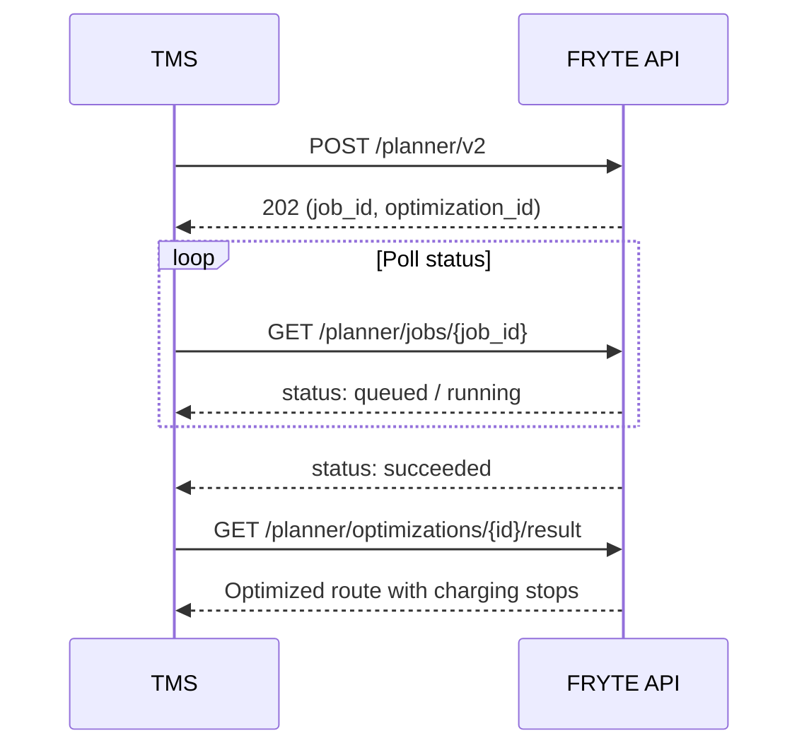

# Workflow

The Planner API uses an asynchronous pattern. You submit a request, poll for completion, then retrieve the result.

## Job statuses

| Status | Description |
|--------|-------------|
| `queued` | Job is waiting to be processed |
| `running` | Optimization is in progress |
| `succeeded` | Route was successfully optimized |
| `not_drivable` | Route cannot be completed with the given parameters |
| `failed` | An error occurred during optimization |
| `canceled` | Job was canceled |

## Polling recommendations

- Start polling after **2–3 seconds**
- Use an interval of **3–5 seconds**
- Typical optimization takes **10–30 seconds**
- Set a timeout of **5 minutes** as a safety limit
